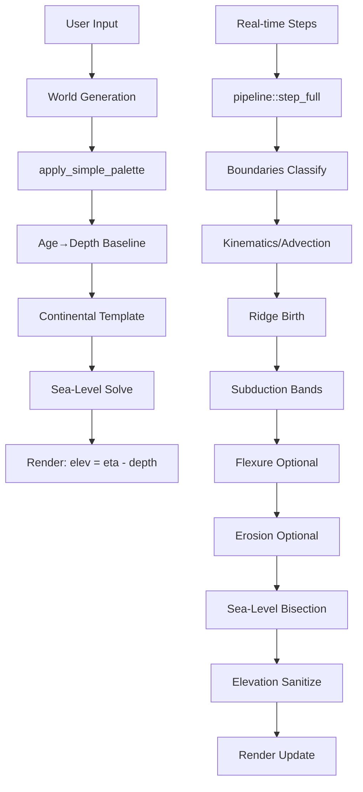
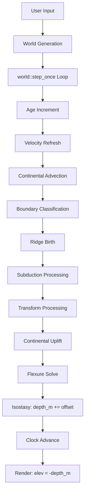
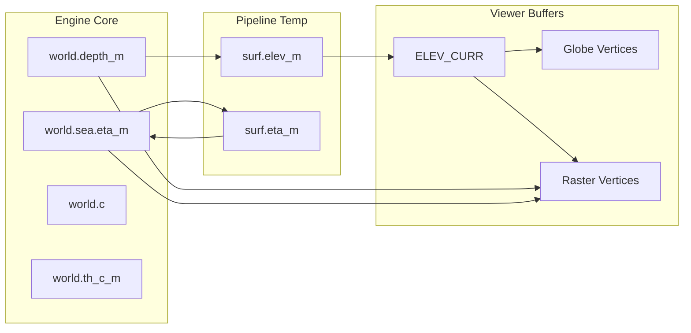
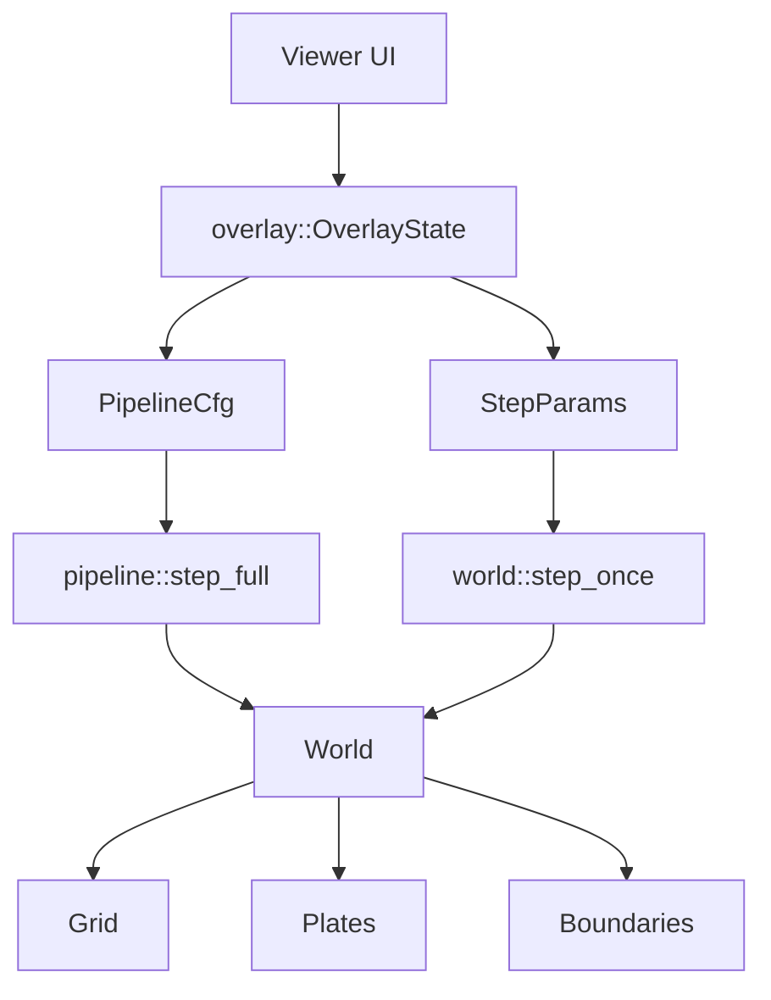

# Aulé Architecture Report

## Executive Summary

The Aulé codebase implements a plate tectonics simulation with dual execution modes (Simple/Advanced) and parallel CPU/GPU pipelines. The architecture shows signs of evolutionary complexity with duplicate execution paths, inconsistent elevation buffer handling, and entangled subsystem dependencies.

## Subsystem Map

### Core Engine (`aule/engine/src/`)

| Module | Responsibility | Key Exports |
|--------|---------------|-------------|
| `world.rs` | World state container, CPU pipeline (`step_once`) | `World`, `StepParams`, `step_once()` |
| `pipeline.rs` | Viewer pipeline (`step_full`), unified physics orchestration | `PipelineCfg`, `step_full()`, `SurfaceFields` |
| `grid.rs` | Geodesic icosphere grid, adjacency, tiling | `Grid`, neighbor lists, cell areas |
| `plates.rs` | Plate seeding, Euler poles, velocity fields | `Plates`, velocity computation |
| `boundaries.rs` | Boundary classification (divergent/convergent/transform) | `Boundaries`, `EdgeClass`, `EdgeKin` |
| `continent.rs` | Continental mask generation, advection, uplift | Continental caps, buoyancy calculation |
| `flexure.rs` / `flexure_gpu.rs` | Elastic plate flexure (CPU/GPU implementations) | Winkler foundation, multigrid solver |
| `isostasy.rs` | Global sea-level regulation, volume conservation | Sea-level offset calculation |
| `surface.rs` | Erosion, diffusion, sediment transport | Stream-power law, hillslope processes |
| `age.rs` | Oceanic age advection, age-depth relationship | Age field management |
| `subduction.rs` | Convergent boundary processing | Trench/arc/backarc bands |
| `transforms.rs` | Transform boundary processing | Strike-slip offsets |

### Viewer (`aule/viewer/src/`)

| Module | Responsibility | Key Exports |
|--------|---------------|-------------|
| `main.rs` | UI orchestration, simulation thread management | Main event loop, world snapshots |
| `globe/pipeline.rs` | 3D globe rendering | Globe mesh, shader pipeline |
| `raster.rs` / `raster_gpu.rs` | 2D map rendering (CPU/GPU) | Raster projection, color mapping |
| `overlay.rs` | UI state management | Overlay toggles, mode switching |

## Execution Flow Analysis

### Simple Mode Pipeline

### Advanced Mode Pipeline

## Data Model

### Elevation Buffers

| Buffer | Location | Purpose | Coordinate System |
|--------|----------|---------|------------------|
| `world.depth_m` | Engine core | Primary bathymetry (positive down) | World-space |
| `world.sea.eta_m` | Sea-level state | Uniform sea-level offset | Scalar |
| `ELEV_CURR` | Viewer global | Cached elevation snapshots | World-space |
| `surf.elev_m` | Pipeline temp | Surface process workspace | World-space |
| Globe vertex buffer | GPU | 3D rendering heights | World-space |
| Raster vertex buffer | GPU | 2D rendering depths | World-space |

### Continental Data

| Field | Storage | Advection | Purpose |
|-------|---------|-----------|---------|
| `world.c` | World-space per-cell | Semi-Lagrangian | Continental fraction [0,1] |
| `world.th_c_m` | World-space per-cell | Semi-Lagrangian | Crust thickness (m) |
| `world.delta_buoy_m` | World-space per-cell | Persistent | Buoyancy amplitude |

### Plate Motion

| Field | Storage | Update Pattern |
|-------|---------|---------------|
| `plates.plate_id` | Per-cell | Advected via nearest-neighbor |
| `plates.pole_axis` | Per-plate | Rigid rotation |
| `world.v_en` | Per-cell | Recomputed from plates |

## Mode Comparison Table

| Aspect | Simple Mode | Advanced Mode | Delta |
|--------|-------------|---------------|-------|
| **Entry Point** | `pipeline::step_full` | `world::step_once` | Different functions |
| **Sea-Level Handling** | Solves `eta`, keeps `depth_m` stable | Writes offset into `depth_m` | Inconsistent state mutation |
| **Elevation Formula** | `elev = eta - depth` | `elev = -depth` | Different renderer inputs |
| **Continental Advection** | One-shot remap with substeps | Per-step semi-Lagrangian | Different algorithms |
| **Flexure** | Optional GPU/Winkler fallback | CPU Winkler only | GPU path unused in Advanced |
| **Buoyancy** | Computed per-step with trust-region | Applied via `apply_uplift_from_c_thc` | Different coupling |
| **Surface Processes** | Integrated in pipeline | Separate module call | Different integration |
| **Performance Logging** | Detailed per-stage timing | Basic timing counters | Different granularity |

## Buffer Flow Diagram

## Performance Characteristics

### Simple Mode
- **Advantages**: Unified pipeline, GPU flexure, stable sea-level
- **Bottlenecks**: Per-frame elevation computation, double buffering overhead
- **Memory**: ~3x elevation buffers (world.depth_m, ELEV_CURR, GPU buffers)

### Advanced Mode  
- **Advantages**: Direct world state mutation, simpler data flow
- **Bottlenecks**: CPU-only flexure, per-step continental advection
- **Memory**: ~2x elevation buffers (world.depth_m, staging)

## Critical Dependencies

## Key Architectural Insights

1. **Dual Pipeline Problem**: Two execution paths (`step_once` vs `step_full`) with different semantics for sea-level handling create renderer inconsistency.

2. **Buffer Multiplication**: Elevation data exists in multiple forms (`depth_m`, `eta_m`, `ELEV_CURR`) with different coordinate conventions.

3. **Mode Entanglement**: Simple/Advanced differences are scattered across multiple modules rather than centralized configuration.

4. **GPU Underutilization**: Advanced mode doesn't use GPU flexure despite availability.

5. **Continental Remapping Duplication**: Two different advection algorithms for the same physical process.

The architecture would benefit from unification around a single pipeline with mode-specific configuration rather than parallel execution paths.
