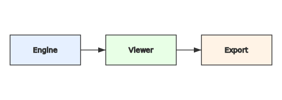

# Architecture

- **engine/**: core compute (Rust + wgpu), fields, kernels (WGSL).
- **viewer/**: egui-based viewer, overlays, diagnostics.
- **export/**: PNG/TIFF/NetCDF (Zarr later) writers.
- **python/**: (later) pyo3 bindings.

Refer to the blueprint in the project canvas for scientific details.
